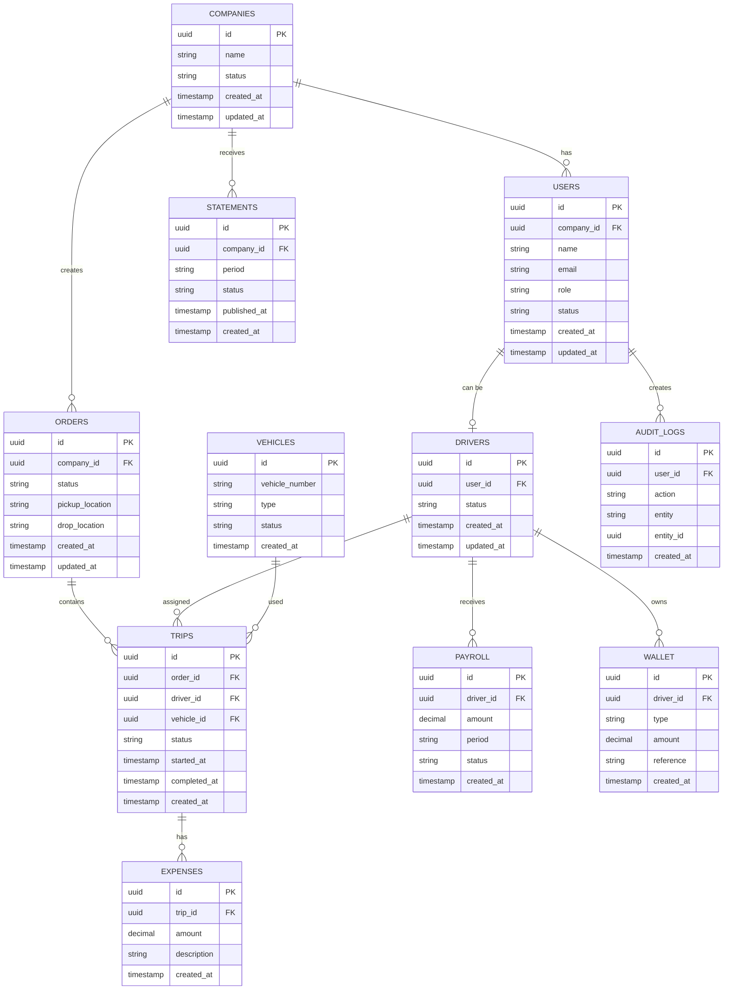

# HireD — Entity Relationship Diagram

## 1. Overview

This document describes the main entities in the HireD database and their relationships.

The database uses **PostgreSQL** with a relational data model.

---

## 2. ER Diagram



---

## 3. Main Relationships

| Relationship | Description |
|---|---|
| Company → Users | A company can have multiple users |
| Company → Orders | A company can create multiple orders |
| Company → Statements | A company can have multiple statements |
| User → Driver | A user can be associated with a driver |
| Order → Trips | An order can have one or more trips |
| Driver → Trips | A driver can be assigned to multiple trips |
| Vehicle → Trips | A vehicle can be used for multiple trips |
| Trip → Expenses | A trip can have multiple expenses |
| Driver → Payroll | A driver can have multiple payroll records |
| Driver → Wallet | A driver can have wallet transactions |
| User → Audit Logs | User actions can be recorded in audit logs |

---

## 4. Core Data Flow

```text
Company
   |
   +── Users
   |
   +── Orders
          |
          +── Trips
                 |
                 +── Driver
                 |
                 +── Vehicle
                 |
                 +── Expenses
                 |
                 +── Payroll
                 |
                 +── Wallet
          |
          +── Statement
```

---

## 5. Relationship Rules

### Company

A company can have multiple users, orders, and statements.

### Order

An order belongs to a company and is associated with trip information.

### Trip

A trip connects an order with a driver and vehicle.

### Driver

A driver can have multiple trips and payroll records.

### Vehicle

A vehicle can be assigned to multiple trips over time.

### Expense

Expenses are associated with a specific trip.

### Payroll

Payroll records are associated with a driver.

### Wallet

Wallet records maintain driver-related financial transactions.

### Statement

Statements are generated for a company for a specific period.

### Audit Log

Audit logs record important user actions within the system.

---

## 6. Data Integrity

The relationships are maintained using:

- Primary keys
- Foreign keys
- Unique constraints
- Not-null constraints
- Database transactions where required

Foreign keys prevent records from referencing non-existing entities.

---

## 7. Source of Truth

The actual database schema is the source of truth for this diagram.

Any schema changes should also update:

- `database.md`
- `er-diagram.md`
- Related backend models/migrations